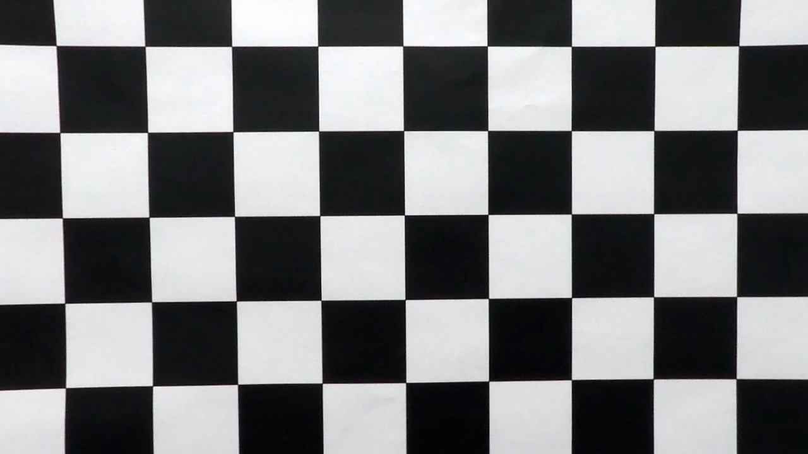
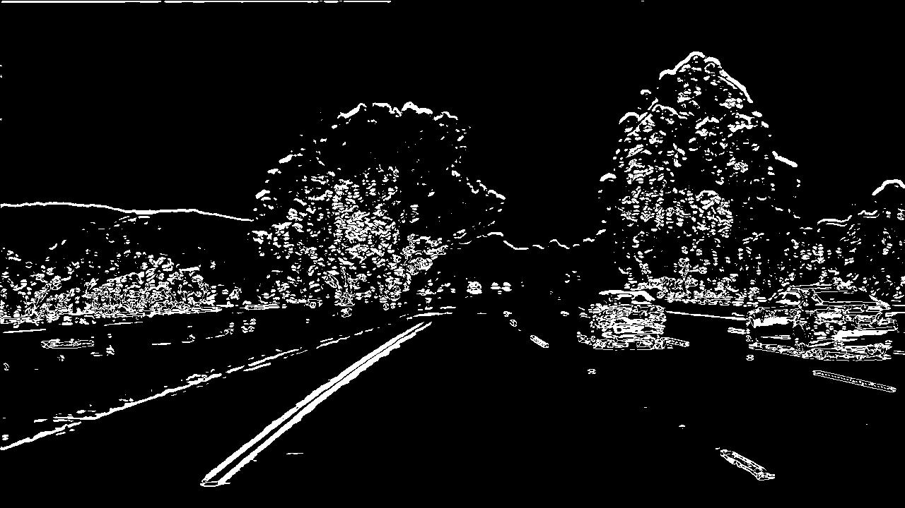
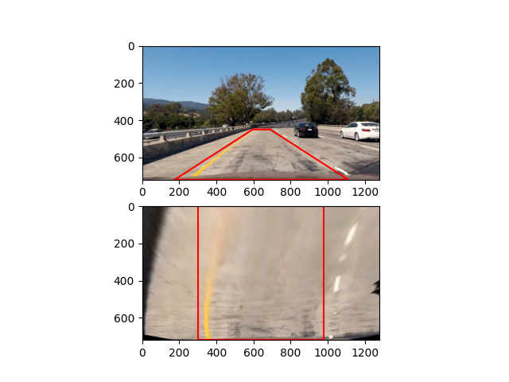
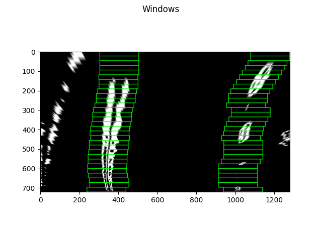
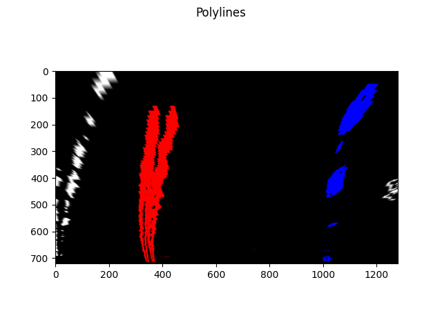

### Advanced Lane Finding
---

The goals / steps of this project are the following:

* Compute the camera calibration matrix and distortion coefficients given a set of chessboard images.
* Apply a distortion correction to raw images.
* Use color transforms, gradients, etc., to create a thresholded binary image.
* Apply a perspective transform to rectify binary image ("birds-eye view").
* Detect lane pixels and fit to find the lane boundary.
* Determine the curvature of the lane and vehicle position with respect to center.
* Warp the detected lane boundaries back onto the original image.
* Output visual display of the lane boundaries and numerical estimation of lane curvature and vehicle position.

### 1. Camera calibration

Camera matrix and distortion coefficients have been computed in `advanced_lanes/camera_distortion.py` file and the results have been save inside `camera_coefficients.pickle` file in order to just load the date when the pipeline starts.

I start by preparing "object points", which will be the (x, y, z) coordinates of the chessboard corners in the world. Here I am assuming the chessboard is fixed on the (x, y) plane at z=0, such that the object points are the same for each calibration image. Thus, `objp` is just a replicated array of coordinates, and `objpoints` will be appended with a copy of it every time I successfully detect all chessboard corners in a test image. `imgpoints` will be appended with the (x, y) pixel position of each of the corners in the image plane with each successful chessboard detection.

The results are visible in the images below where the image on the left is distorted, and the image on the right is corrected.

Distorted chessboard image             |  Undistorted chessboard image
:-------------------------:|:-------------------------:
  |  

### 2. Pipeline

#### Image undistortion
This part contains all the image processing in order to detect lines in a better way.

First we undistort the image using the precalculated distortion coefficients. On the left side we can see the distorted image and on the right distorted.

Distorted chessboard image             |  Undistorted chessboard image
:-------------------------:|:-------------------------:
  |  

#### Binary Image

The transformation to binary image is in `threshold.py` file and the following thresholds have been applied on the Saturation and Lightness channels in HLS image:
 - Absolute Sobel threshold on x axis
 - Magnitude of the Sobel threshold
 - Direction of the gradient threshold (tested but unused)
 - Thresholding binary image in the RGB channel
Every Sobel transformation also uses Gaussian smoothing process in order to smooth out the image. After applying the all transformations and combining them in the line 70 of `threshold.py`
`combined_binary[(red_binary == 1) & (gradx == 1) | ((mag_binary == 1) & (grady == 1))] = 1`
we get the following results

#### Perspective transformation
Next step is transforming the image into birds eye view. This is done by first selection the four source points like shown in `perspective.py` and selecting appropriate destination points. The relation between source and destination points will define the transformation. The following src points have been selected:
| Source Points  | Destination Points |
| ------------- | ------------- |
| 690, 450  | 980, 0  |
| 1110, 720  | 980, 720  |
| 175, 720  | 300, 1280  |
| 595, 450  | 300, 0  |

#### Lane detection

After we have warped road image into birds view we can run sliding window algorithm tod detect lanes and determine their polynomial representation. We can see the detected sliding windows on the left image and the marked polynomials which represent left and right lane on the right image.

Sliding windows             |  Lane polynomials
:-------------------------:|:-------------------------:
  |  

### Results
You can check out the video [here](tracked_video.mp4)

### Discussion
The lane detection pipeline is straightforward; first we calculate the camera matrix and distortion coefficients in order to undistort every incoming image from the video. We have save these parameters in the pickle file and load the before starting to process the video.

When the pipeline starts (by running `main.py` script from the advance_lanes directory) the camera parameters and distortion coefficients are loaded, and `LaneDetector` class is initialized. After that we start processing video by running `process_image` function on every image from the video. This shows the rough flow of lane detection:
undistort image => transform to binary image => transform perspective => run sliding windows to detect pixels that might be lanes => construct best fit polynomial to represent lanes

The biggest bottlenecks were image transformation to binary, and it was tricky to tune parameters since the transformation may work for every image we have in test dataset, but if only one image appears for which the transformation does not work correctly, it ruins the lane detection. In order to mitigate that problem I have introduce the that every lane remembers its past fits and the best fit is decided by averaging the best fit every iteration for the past 4 fits as can be seen [here](https://github.com/jbajic/CarND-Advanced-Lane-Lines/blob/33164b8fce06cc14d8561042e1866768aa889917/advanced_lanes/line_detection.py#L44), and that roughly solves the problem to some extent.

In order to improve this project, we can change an approach to detect the bases of left and right lines by using the code from `test.py` which goes through the histogram and search for the peaks. The algorithm would need few tweaks in order to find the peaks of left and right lane but that would definitely be an improvement in just dividing the middle of the road, and relying in the previous fits.

Also the transformation part of the lane detection algorithm lacks robustness since it relies on the assumption that tweaking the transformation for the given images would work on all.
